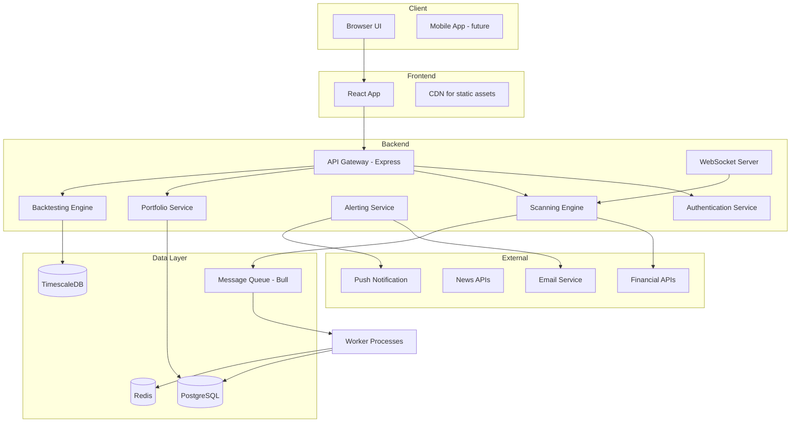

# Investment Scanner Application - Architecture & Design

## Overview
Investment Scanner is a professional-grade application for scanning multiple asset classes (stocks, ETFs, cryptocurrencies, bonds, real estate, forex, commodities) with real-time monitoring, technical analysis, fundamental analysis, news aggregation, alerting, portfolio tracking, and backtesting. The application is designed initially as a personal tool with a path to evolve into a SaaS web application.

## Core Principles
- **Free & Open Source**: All technologies used are free of cost and have permissive licenses (MIT, Apache, BSD).
- **Future-proof**: Architecture supports scaling to multi-tenant SaaS with minimal changes.
- **Modular & Reusable**: Components are loosely coupled, enabling independent development and testing.
- **Best Practices**: Follow industry standards for code quality, testing, documentation, and security.
- **Personal Use First**: Runs locally on a laptop, accessible via a web browser.

## Technology Stack

### Backend
- **Runtime**: Node.js 20+ (LTS) with TypeScript
- **Framework**: Express.js (lightweight) + NestJS (optional for structure)
- **API**: RESTful API with OpenAPI/Swagger documentation
- **Real-time**: WebSocket (Socket.io) for live price updates
- **Authentication**: JWT with Passport.js (extensible to OAuth2)
- **Job Queue**: Bull (Redis) for scheduled scanning tasks
- **Caching**: Redis (for API rate limiting and data caching)
- **Logging**: Winston with structured logging
- **Monitoring**: OpenTelemetry for tracing

### Database
- **Primary**: PostgreSQL with TimescaleDB extension (for both local development and production). SQLite may be used for lightweight local testing if needed.
- **ORM**: Prisma (type-safe database client, migrations)
- **Time-series**: TimescaleDB extension (for historical price data)
- **Caching**: Redis

### Frontend
- **Framework**: React 18+ with TypeScript
- **Build Tool**: Vite (fast development and production builds)
- **UI Library**: Material-UI (MUI) or Chakra UI (component-based)
- **State Management**: Zustand (lightweight) or Redux Toolkit
- **Charts**: Recharts or TradingView Lightweight Charts
- **Routing**: React Router v6

### Data Sources (Free APIs)
- **Stocks/ETFs**: Yahoo Finance (via `yahoo-finance2`), Alpha Vantage (free tier), IEX Cloud (free tier)
- **Cryptocurrencies**: CoinGecko API (free, no API key required), Binance API
- **Forex/Commodities**: Alpha Vantage, ExchangeRate-API
- **News**: NewsAPI (free tier), GNews API
- **Fundamental Data**: Financial Modeling Prep (free tier), Yahoo Finance
- **Real-time Data**: WebSocket connections where available (e.g., Binance WS, Yahoo Finance WS)

### Infrastructure & DevOps
- **Containerization**: Docker + Docker Compose (local development)
- **CI/CD**: GitHub Actions (free for public repos)
- **Cloud Deployment**: Fly.io (free tier) or Railway (free credits) for SaaS future
- **Monitoring**: Prometheus + Grafana (self-hosted)
- **Secret Management**: Environment variables with dotenv

## System Architecture

### High-Level Diagram


### Component Descriptions
1. **API Gateway**: Handles HTTP requests, routing, rate limiting, and authentication.
2. **Authentication Service**: Manages user registration, login, JWT issuance, and session management.
3. **Scanning Engine**: Core scanning logic; runs scheduled scans based on user-defined criteria (technical indicators, fundamental ratios, price movements). Supports real-time streaming for watchlists.
4. **Alerting Service**: Evaluates scan results against user alert rules and delivers notifications via email, desktop, or mobile push.
5. **Portfolio Service**: Trades and holdings management, performance calculation, and portfolio analytics.
6. **Backtesting Engine**: Historical simulation of trading strategies using time-series data.
7. **Data Ingestion Module**: Fetches data from external APIs, normalizes, and stores in database/cache.
8. **WebSocket Server**: Pushes real-time price updates and alert triggers to connected clients.

## Data Flow
1. User configures scan criteria via UI.
2. Frontend sends request to API Gateway.
3. Scanning Engine retrieves latest market data from cached sources or external APIs.
4. Engine applies technical/fundamental analysis, generating scan results.
5. Results are stored in DB and sent via WebSocket to UI.
6. If alert conditions met, Alerting Service triggers notification.
7. User can view historical scans, portfolio, and run backtests.

## Feature Roadmap

### Phase 1: Personal Tool (MVP) – Core Monitoring
- [ ] Project setup and basic structure
- [ ] User authentication (local user only)
- [ ] Data ingestion from free APIs (Yahoo Finance, CoinGecko, Alpha Vantage)
- [ ] Real‑time price display for watchlists
- [ ] Basic scanning (price thresholds, simple moving averages)
- [ ] Email alerts (via SMTP)
- [ ] Portfolio tracking (manual entry)
- [ ] Basic dashboard UI with summary cards
- [ ] Market overview (indices, sector performance)
- [ ] Sector‑level trend visualization

### Phase 2: Advanced Research & Analysis
- [ ] Advanced technical indicators (RSI, MACD, Bollinger Bands, Ichimoku, Fibonacci)
- [ ] Custom indicator builder
- [ ] Fundamental analysis (P/E, P/B, EPS, dividend yield, debt/equity)
- [ ] Financial statement viewer (income, balance sheet, cash flow)
- [ ] Sector rotation analysis (relative strength, momentum)
- [ ] Market breadth indicators (advance/decline, new highs/lows)
- [ ] News aggregation with sentiment scoring
- [ ] Earnings calendar and surprise tracking
- [ ] Backtesting engine (historical strategy testing)
- [ ] Interactive charting with drawing tools
- [ ] Export scans to CSV/PDF
- [ ] Risk metrics (Sharpe ratio, max drawdown, volatility)

### Phase 3: SaaS Enablement & Scalability
- [ ] Multi‑tenancy (user isolation at database level)
- [ ] Subscription plans (free, premium, enterprise)
- [ ] Payment integration (Stripe/Paddle)
- [ ] Advanced user management (teams, roles, permissions)
- [ ] API rate limiting and usage analytics per user
- [ ] Cloud deployment with auto‑scaling (Fly.io / Railway)
- [ ] Monitoring and analytics dashboard (user activity, system health)
- [ ] Mobile‑responsive UI / Progressive Web App (PWA)
- [ ] API documentation portal (Swagger UI)

### Phase 4: Advanced & Niche Features
- [ ] Machine learning‑based predictions (price direction, volatility)
- [ ] Social features (share scans, follow other investors, community)
- [ ] Broker integration (read‑only via Plaid, etc.)
- [ ] Automated paper trading
- [ ] Options analysis (Greeks, implied volatility, options chain)
- [ ] Corporate actions tracking (splits, dividends, M&A)
- [ ] Global macroeconomic indicators integration
- [ ] Mobile app (React Native / Capacitor)
- [ ] Voice‑controlled queries (experimental)

## Project Structure
```
investment-scanner/
├── backend/
│   ├── src/
│   │   ├── api/          # REST endpoints
│   │   ├── services/     # business logic
│   │   ├── data/         # data ingestion & models
│   │   ├── scanners/     # scanning algorithms
│   │   ├── alerts/       # alerting logic
│   │   ├── portfolio/    # portfolio management
│   │   └── backtest/     # backtesting engine
│   ├── prisma/           # database schema & migrations
│   └── tests/
├── frontend/
│   ├── src/
│   │   ├── components/   # reusable UI components
│   │   ├── pages/        # page components
│   │   ├── hooks/        # custom React hooks
│   │   ├── store/        # state management
│   │   ├── services/     # API clients
│   │   └── utils/        # utilities
│   └── public/
├── shared/               # shared types/utilities
├── docker/
├── docs/                 # documentation
├── plans/                # architecture & planning docs
└── scripts/              # deployment & maintenance scripts
```

## Licensing Considerations
All selected libraries and frameworks are under permissive open‑source licenses (MIT, Apache 2.0, BSD). No copyleft (GPL) dependencies are used in the core production code to ensure freedom for future commercialization.

## Development & Deployment
- **Local Development**: `docker‑compose up` starts PostgreSQL, Redis, and the backend; frontend runs via Vite dev server.
- **Testing**: Unit tests (Jest), integration tests (Supertest), E2E (Cypress).
- **CI/CD**: GitHub Actions runs tests, builds Docker images, and deploys to staging on push.
- **Production**: Containerized deployment on Fly.io with PostgreSQL managed service.

## Status Tracking
| Feature | Phase | Status | Notes |
|---------|-------|--------|-------|
| Project Setup | 1 | Not Started | |
| Authentication | 1 | Not Started | |
| Data Ingestion | 1 | Not Started | |
| Real‑time Prices | 1 | Not Started | |
| Basic Scanning | 1 | Not Started | |
| Email Alerts | 1 | Not Started | |
| Portfolio Tracking | 1 | Not Started | |
| Dashboard UI | 1 | Not Started | |
| Market Overview | 1 | Not Started | |
| Sector Trend Visualization | 1 | Not Started | |

*This document will be updated as development progresses.*