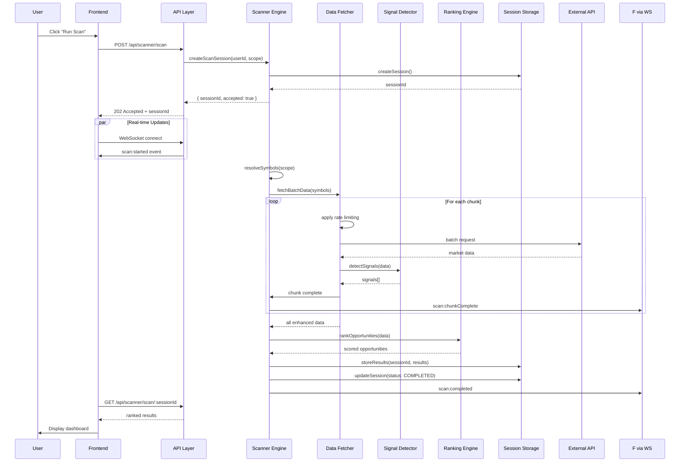

# Real-Time Scanner (Batch-Based) Architecture

## 🎯 Product Goal
The scanner must help users answer: **"What are the best trading opportunities right now?"**  
It prioritizes **actionable insights over raw data**.

## 📋 Current State Analysis

### Existing Components
1. **Condition Evaluator** (`backend/src/scanners/evaluator.ts`)
   - Supports price, indicator, change, and fundamental conditions
   - Logical operators (AND, OR, NOT)
   - Technical indicators via `technicalindicators` library
   - Market data fetching from database

2. **Scanner Service** (`backend/src/scanners/service.ts`)
   - CRUD operations for scanner rules
   - Basic scanning with watchlist integration
   - Scan logging

3. **Frontend Scanner UI** (`frontend/src/components/Scanner/`)
   - Rule management interface
   - Condition builder with dual mode
   - Basic scan triggering

### Gaps to Address
- No real-time/batch scanning dashboard
- Missing ranking/scoring system
- No crossover detection support
- Limited signal types (RSI, EMA, MACD, Volume, Price change)
- No batch API rate limiting
- No session-based temporary results storage

## 🏗️ High-Level Architecture

### System Components
```
┌─────────────────────────────────────────────────────────────┐
│                     Frontend (React)                         │
│  ┌─────────────────────────────────────────────────────┐    │
│  │                Scanner Dashboard                     │    │
│  │  • Ranked opportunities table                        │    │
│  │  • Run Scan button                                   │    │
│  │  • Progress feedback                                 │    │
│  │  • Last updated timestamp                            │    │
│  └─────────────────────────────────────────────────────┘    │
└─────────────────────────────────────────────────────────────┘
                                    │
                                    │ HTTP/WebSocket
                                    ▼
┌─────────────────────────────────────────────────────────────┐
│                     Backend (Node.js/Express)                │
│  ┌─────────────┐  ┌─────────────┐  ┌─────────────┐         │
│  │  API Layer  │  │ Scanner     │  │ Data        │         │
│  │  • REST     │  │ Engine      │  │ Fetching    │         │
│  │  • WebSocket│  │ • Signal    │  │ • Batch API │         │
│  │             │  │   detection │  │ • Rate limit│         │
│  │             │  │ • Ranking   │  │ • Caching   │         │
│  │             │  │ • Scoring   │  │             │         │
│  └─────────────┘  └─────────────┘  └─────────────┘         │
│         │               │               │                   │
│         └───────────────┼───────────────┘                   │
│                         │                                   │
│  ┌─────────────┐  ┌─────────────┐  ┌─────────────┐         │
│  │ Storage     │  │ Existing    │  │ External    │         │
│  │ • Session   │  │ Evaluator   │  │ APIs        │         │
│  │   DB/Cache  │  │ • Reuse     │  │ • Yahoo     │         │
│  │ • PostgreSQL│  │   condition │  │ • Alpha     │         │
│  │ • Redis     │  │   engine    │  │   Vantage   │         │
│  └─────────────┘  └─────────────┘  └─────────────┘         │
└─────────────────────────────────────────────────────────────┘
```

### Data Flow
1. **User Interaction** → Frontend triggers scan
2. **API Request** → Backend receives scan request with scope
3. **Symbol Resolution** → Determine universe (preset/watchlist/custom)
4. **Batch Data Fetching** → Fetch market data in chunks with rate limiting
5. **Signal Detection** → Apply indicator calculations and crossover detection
6. **Ranking & Scoring** → Compute scores based on signals matched
7. **Results Storage** → Store in session DB/cache
8. **Response** → Return ranked results to frontend
9. **UI Update** → Display table with actionable insights

## 🔧 Detailed Module Design

### 1. Scanner Engine Core

#### Signal Detection Module
```typescript
interface Signal {
  type: 'RSI' | 'EMA' | 'MACD' | 'VOLUME' | 'PRICE_CHANGE';
  name: string; // e.g., 'RSI_OVERSOLD', 'EMA_CROSSOVER_BULLISH'
  direction: 'BULLISH' | 'BEARISH' | 'NEUTRAL';
  strength: number; // 0-1 confidence score
  timestamp: Date;
  metadata: Record<string, any>;
}

interface CrossoverDetection {
  previousValue: number;
  currentValue: number;
  threshold: number;
  crossedAbove: boolean;
  crossedBelow: boolean;
}

class SignalDetector {
  detectRSISignals(data: MarketData): Signal[];
  detectEMASignals(data: MarketData, shortPeriod: number, longPeriod: number): Signal[];
  detectMACDSignals(data: MarketData): Signal[];
  detectVolumeSpikes(data: MarketData, lookbackPeriod: number): Signal[];
  detectPriceChange(data: MarketData, period: '1d' | '1w' | '1m'): Signal[];
  detectCrossovers(series: number[], threshold?: number): CrossoverDetection[];
}
```

#### Ranking Engine
```typescript
interface RankingConfig {
  signalWeights: Record<string, number>; // Signal type → weight
  volumeWeight: number;
  priceChangeWeight: number;
  recencyBias: number; // Favor recent signals
}

interface ScoredOpportunity {
  symbol: string;
  price: number;
  changePercent: number;
  volume: number;
  signals: Signal[];
  score: number;
  breakdown: {
    signalScore: number;
    volumeScore: number;
    changeScore: number;
    recencyScore: number;
  };
  rank: number;
}

class RankingEngine {
  constructor(config: RankingConfig);
  rankOpportunities(opportunities: Opportunity[]): ScoredOpportunity[];
  calculateSignalScore(signals: Signal[]): number;
  calculateVolumeScore(volume: number, avgVolume: number): number;
  calculateChangeScore(changePercent: number): number;
}
```

### 2. Data Fetching Layer

#### Batch API Manager
```typescript
interface BatchRequest<T> {
  symbols: string[];
  requestFn: (symbols: string[]) => Promise<T[]>;
  chunkSize: number;
  delayBetweenChunks: number;
}

class BatchAPIManager {
  private rateLimiter: RateLimiter;
  
  async executeBatch<T>(request: BatchRequest<T>): Promise<T[]>;
  chunkSymbols(symbols: string[], size: number): string[][];
  withRetry<T>(fn: () => Promise<T>, maxRetries: number): Promise<T>;
}

class RateLimiter {
  constructor(requestsPerSecond: number);
  async acquire(): Promise<void>;
}
```

#### Market Data Service
```typescript
interface MarketDataRequest {
  symbols: string[];
  indicators: string[];
  periods: string[];
  includeHistorical: boolean;
}

interface EnhancedMarketData extends MarketData {
  indicators: Record<string, number>;
  signals: Signal[];
  metadata: {
    lastUpdated: Date;
    source: string;
    confidence: number;
  };
}

class MarketDataService {
  constructor(
    private yahooService: YahooService,
    private cache: CacheService,
    private batchManager: BatchAPIManager
  ) {}
  
  async fetchBatchData(request: MarketDataRequest): Promise<EnhancedMarketData[]>;
  async calculateIndicators(data: MarketData): Promise<Record<string, number>>;
  async detectSignals(data: MarketData): Promise<Signal[]>;
}
```

### 3. Storage Layer

#### Session Storage
```typescript
interface ScanSession {
  id: string;
  userId: string;
  scope: ScanScope;
  startedAt: Date;
  completedAt?: Date;
  status: 'PENDING' | 'RUNNING' | 'COMPLETED' | 'FAILED';
  results: ScoredOpportunity[];
  metadata: {
    symbolsScanned: number;
    durationMs: number;
    signalsDetected: number;
  };
}

interface ScanResultCache {
  sessionId: string;
  symbol: string;
  data: EnhancedMarketData;
  signals: Signal[];
  score: number;
  timestamp: Date;
  ttl: number; // Time to live in seconds
}

class SessionStorageService {
  async createSession(userId: string, scope: ScanScope): Promise<ScanSession>;
  async updateSession(sessionId: string, updates: Partial<ScanSession>): Promise<void>;
  async storeResults(sessionId: string, results: ScoredOpportunity[]): Promise<void>;
  async getSessionResults(sessionId: string): Promise<ScoredOpportunity[]>;
  async cleanupOldSessions(ttlHours: number): Promise<void>;
}
```

## 🌐 API Design

### REST Endpoints

#### Scanner Dashboard API
```
GET    /api/scanner/dashboard          # Get dashboard state
POST   /api/scanner/scan               # Trigger new scan
GET    /api/scanner/scan/:sessionId    # Get scan results
GET    /api/scanner/scan/:sessionId/progress  # Get scan progress
DELETE /api/scanner/scan/:sessionId    # Cancel/delete scan
```

#### Scan Scope Management
```
GET    /api/scanner/scope/presets      # Get available presets
POST   /api/scanner/scope/custom       # Create custom scope
GET    /api/scanner/scope/watchlists   # Get user watchlists for scanning
```

#### Signal Management
```
GET    /api/scanner/signals            # List available signal types
GET    /api/scanner/signals/:type      # Get signal details
POST   /api/scanner/signals/custom     # Create custom signal (future)
```

### WebSocket Events
```typescript
interface ScannerWebSocketEvents {
  'scan:started': { sessionId: string; totalSymbols: number };
  'scan:progress': { sessionId: string; completed: number; total: number };
  'scan:chunkComplete': { sessionId: string; symbols: string[]; signalsFound: number };
  'scan:completed': { sessionId: string; results: ScoredOpportunity[] };
  'scan:error': { sessionId: string; error: string };
}
```

## 📊 Data Models

### Core Entities
```typescript
// Database Models (extending existing Prisma schema)
model ScanSession {
  id           String   @id @default(cuid())
  userId       String
  scopeType    String   // 'PRESET' | 'WATCHLIST' | 'CUSTOM'
  scopeData    Json     // JSON containing symbols or watchlist ID
  status       String   // 'PENDING' | 'RUNNING' | 'COMPLETED' | 'FAILED'
  startedAt    DateTime @default(now())
  completedAt  DateTime?
  results      Json?    // JSON array of ScoredOpportunity
  metadata     Json?    // Statistics and metadata
  
  @@index([userId, startedAt])
  @@index([status])
}

model SignalDefinition {
  id          String   @id @default(cuid())
  type        String   // 'RSI' | 'EMA' | 'MACD' | etc.
  name        String   // Human-readable name
  code        String   // Machine identifier
  description String?
  parameters  Json     // Default parameters
  weight      Float    @default(1.0)
  isActive    Boolean  @default(true)
  
  @@unique([type, code])
}

// In-memory/Redis models
interface CachedMarketData {
  symbol: string;
  data: EnhancedMarketData;
  timestamp: Date;
  ttl: number;
}
```

### Request/Response DTOs
```typescript
interface TriggerScanRequest {
  scope: {
    type: 'PRESET' | 'WATCHLIST' | 'CUSTOM';
    presetId?: string; // e.g., 'TOP_100', 'SP500'
    watchlistId?: string;
    symbols?: string[];
  };
  signals?: string[]; // Specific signals to detect (empty = all)
  rankingConfig?: Partial<RankingConfig>;
}

interface ScanProgressResponse {
  sessionId: string;
  status: 'PENDING' | 'RUNNING' | 'COMPLETED' | 'FAILED';
  progress: {
    completed: number;
    total: number;
    percentage: number;
  };
  estimatedTimeRemaining?: number; // in seconds
  currentChunk?: string[]; // Symbols being processed
}

interface ScannerDashboardResponse {
  recentScans: ScanSession[];
  topOpportunities: ScoredOpportunity[];
  signalStats: Record<string, number>;
  lastUpdated: Date;
}
```

## 🔄 Execution Flow

### Step-by-Step: "Run Scan" Click



### Performance Optimization Steps
1. **Symbol Chunking**: Process 20-30 symbols per batch
2. **Parallel Processing**: Process chunks in parallel with concurrency limit
3. **Caching**: Cache indicator calculations for 5 minutes
4. **Lazy Loading**: Load historical data only when needed
5. **Progress Streaming**: Stream results as they become available

## ⚡ Performance Strategy

### Batch Processing Configuration
```typescript
const BATCH_CONFIG = {
  CHUNK_SIZE: 25, // Symbols per API call
  MAX_CONCURRENT_CHUNKS: 2, // Parallel requests
  DELAY_BETWEEN_CHUNKS: 1000, // ms (respect rate limits)
  REQUEST_TIMEOUT: 10000, // ms
  MAX_RETRIES: 2,
};
```

### Caching Strategy
1. **Market Data Cache**: 5-minute TTL for price data
2. **Indicator Cache**: 10-minute TTL for computed indicators
3. **Session Cache**: 1-hour TTL for scan results
4. **Signal Cache**: Pre-computed common signals

### Rate Limiting
- Yahoo Finance API: 100 requests/hour (free tier)
- Alpha Vantage: 5 requests/minute (free tier)
- Implement token bucket algorithm
- Queue overflow handling with exponential backoff

### Performance Targets
- **100 symbols**: < 10 seconds
- **300 symbols**: < 20 seconds
- **Memory usage**: < 500MB for max scan
- **Concurrent users**: Support 5+ simultaneous scans

## 🚀 Extensibility Plan

### Phase 1: MVP (Current)
- Basic signal detection (RSI, EMA, MACD, Volume, Price change)
- Simple ranking (signal count + weighting)
- Manual trigger only
- Session-based temporary storage

### Phase 2: Enhanced Features
- **Advanced Signals**: Bollinger Bands, Stochastic, ATR, OBV
- **Machine Learning**: Anomaly detection for unusual volume/price
- **Custom Signal Builder**: Drag-and-drop signal creation
- **Alert System**: Email/notification when signals trigger
- **Backtesting Integration**: Test scanner performance historically

### Phase 3: Production Scale
- **Real-time Streaming**: WebSocket-based live scanning
- **Distributed Processing**: Worker queues for large universes
- **Multi-user Support**: Tenant isolation and sharing
- **Advanced Analytics**: Performance metrics, false positive analysis
- **Mobile App**: Push notifications for opportunities

### Plugin Architecture
```typescript
interface SignalPlugin {
  name: string;
  version: string;
  detect(data: MarketData, config: any): Signal[];
  validateConfig(config: any): boolean;
  defaultConfig: any;
}

class PluginRegistry {
  registerSignalPlugin(plugin: SignalPlugin): void;
  getAvailableSignals(): string[];
  detectWithPlugin(pluginName: string, data: MarketData, config: any): Signal[];
}
```

## ⚖️ Design Tradeoffs

### 1. Batch vs Real-time Streaming
- **Chosen**: Batch with progress streaming
- **Rationale**: Free APIs have rate limits; batch allows controlled fetching
- **Tradeoff**: Slight delay (seconds) vs real-time immediacy

### 2. In-memory vs Database Storage
- **Chosen**: Hybrid approach (Redis + PostgreSQL)
- **Rationale**: Session data is ephemeral (1-hour TTL) but needs fast access. Redis provides sub-millisecond reads for progress updates, while PostgreSQL persists scan history.
- **Tradeoff**: Added complexity of two storage systems vs single system simplicity

### 3. Comprehensive vs Focused Signal Detection
- **Chosen**: Focused MVP signals (RSI, EMA, MACD, Volume, Price change)
- **Rationale**: 80/20 rule - these signals cover most common trading strategies
- **Tradeoff**: Less coverage of niche strategies vs overwhelming users with complexity

### 4. Simple vs Sophisticated Ranking
- **Chosen**: Weighted signal counting for MVP
- **Rationale**: Easy to understand and explain to users
- **Tradeoff**: Less accurate than ML-based ranking but more transparent

### 5. Client-side vs Server-side Processing
- **Chosen**: Server-side processing with WebSocket progress
- **Rationale**: Heavy computations (indicator calculations) belong on server
- **Tradeoff**: Server load vs client capability utilization

## 🛠️ Implementation Roadmap

### Phase 1: Core Scanner Engine (Week 1-2)
1. **Extend Condition Evaluator** (`backend/src/scanners/evaluator.ts`)
   - Add crossover detection logic
   - Implement signal strength scoring
   - Add volume spike detection

2. **Create Batch Data Fetcher** (`backend/src/scanners/batch-fetcher.ts`)
   - Implement chunking and rate limiting
   - Add retry logic with exponential backoff
   - Integrate with existing Yahoo service

3. **Build Signal Detector** (`backend/src/scanners/signal-detector.ts`)
   - Implement RSI, EMA, MACD signal detection
   - Add crossover detection for all indicators
   - Create volume spike detection

### Phase 2: Ranking & Storage (Week 3)
1. **Develop Ranking Engine** (`backend/src/scanners/ranking-engine.ts`)
   - Implement weighted scoring algorithm
   - Add configurable signal weights
   - Create opportunity ranking logic

2. **Create Session Storage** (`backend/src/scanners/session-storage.ts`)
   - Redis integration for fast access
   - PostgreSQL for persistent history
   - Cleanup job for old sessions

3. **Build Scanner Service** (`backend/src/scanners/scanner-service.ts`)
   - Orchestrate scanning workflow
   - Handle progress tracking
   - Manage WebSocket notifications

### Phase 3: API & Frontend (Week 4)
1. **Extend Scanner API** (`backend/src/api/scanners/router.ts`)
   - Add new endpoints for batch scanning
   - Implement WebSocket event broadcasting
   - Add progress tracking endpoints

2. **Build Scanner Dashboard** (`frontend/src/components/ScannerDashboard/`)
   - Create ranked opportunities table
   - Implement progress indicator
   - Add "Run Scan" button with scope selection
   - Display last updated timestamp

3. **Integrate with Existing UI** (`frontend/src/components/Scanner/`)
   - Merge new dashboard with existing rule management
   - Update condition builder to support new signals
   - Add crossover detection UI

### Phase 4: Testing & Optimization (Week 5)
1. **Performance Testing**
   - Load test with 300 symbols
   - Memory usage profiling
   - API rate limit compliance testing

2. **Error Handling & Resilience**
   - Implement graceful degradation
   - Add comprehensive logging
   - Create monitoring dashboard

3. **User Acceptance Testing**
   - Gather feedback on ranking accuracy
   - Test UI responsiveness
   - Validate signal detection correctness

## 📈 Success Metrics

### Technical Metrics
- **Scan Performance**: < 20 seconds for 300 symbols
- **API Reliability**: 99.9% successful scans
- **Memory Efficiency**: < 500MB peak usage
- **Concurrency**: Support 10+ simultaneous users

### User Experience Metrics
- **Time to Insight**: < 30 seconds from click to ranked results
- **Signal Accuracy**: > 80% of detected signals are actionable
- **User Satisfaction**: > 4/5 rating for scanner usefulness
- **Adoption Rate**: > 60% of active users use scanner weekly

### Business Metrics
- **Engagement**: Increased time spent in application
- **Retention**: Higher user retention for scanner users
- **Monetization**: Premium feature potential (advanced signals)

## 🚨 Risk Mitigation

### Technical Risks
1. **API Rate Limiting**
   - **Mitigation**: Implement token bucket algorithm with queueing
   - **Fallback**: Use cached data when API limits exceeded

2. **Performance Degradation with Scale**
   - **Mitigation**: Implement horizontal scaling with worker queues
   - **Fallback**: Limit scan size for free tier users

3. **Data Inconsistency**
   - **Mitigation**: Implement data validation and sanitization
   - **Fallback**: Mark suspicious data and provide confidence scores

### Product Risks
1. **Signal Overload**
   - **Mitigation**: Curate top 5-10 most valuable signals initially
   - **Fallback**: Allow users to filter/prioritize signals

2. **False Positives**
   - **Mitigation**: Implement signal strength thresholds
   - **Fallback**: Provide confidence scores and historical accuracy

3. **User Understanding**
   - **Mitigation**: Create educational tooltips and documentation
   - **Fallback**: Offer simplified "beginner mode"

## 🔗 Integration Points

### Existing System Integration
1. **Condition Evaluator Reuse**
   - Extend rather than replace existing evaluator
   - Add signal detection as a new layer on top

2. **Watchlist Integration**
   - Use existing watchlist service for scan scope
   - Add symbols to watchlist from scan results

3. **Alert System Integration** (Future)
   - Trigger alerts based on scanner signals
   - Use scanner as alert condition source

### External Service Integration
1. **Market Data APIs**
   - Yahoo Finance (primary)
   - Alpha Vantage (fallback)
   - Polygon.io (premium option)

2. **Cache Services**
   - Redis for session storage
   - PostgreSQL for persistent history

3. **Monitoring & Analytics**
   - Sentry for error tracking
   - Prometheus for performance metrics
   - Mixpanel for user behavior analytics

## 🎯 Conclusion

The Real-Time Scanner (Batch-Based) system provides a balanced approach to delivering actionable trading insights while respecting technical constraints of free market data APIs. By focusing on the most valuable signals first and implementing a transparent ranking system, we create immediate user value while laying the foundation for future enhancements.

The architecture prioritizes:
1. **User Experience**: Fast, responsive scanning with clear progress feedback
2. **Technical Sustainability**: Respect for API rate limits and efficient resource usage
3. **Extensibility**: Plugin architecture for future signal types and ranking algorithms
4. **Maintainability**: Clear separation of concerns and well-defined interfaces

This design enables the scanner to answer the core question **"What are the best trading opportunities right now?"** with speed, accuracy, and actionable insights.

---

## 📋 Next Steps

1. **Review this architecture** with the development team
2. **Create detailed technical specifications** for each module
3. **Set up development environment** with required dependencies
4. **Begin implementation** following the phased roadmap
5. **Establish monitoring** from day one of development

The scanner represents a significant value-add feature that can differentiate the trading application and drive user engagement. With careful implementation and continuous iteration based on user feedback, it can become the cornerstone feature of the platform.