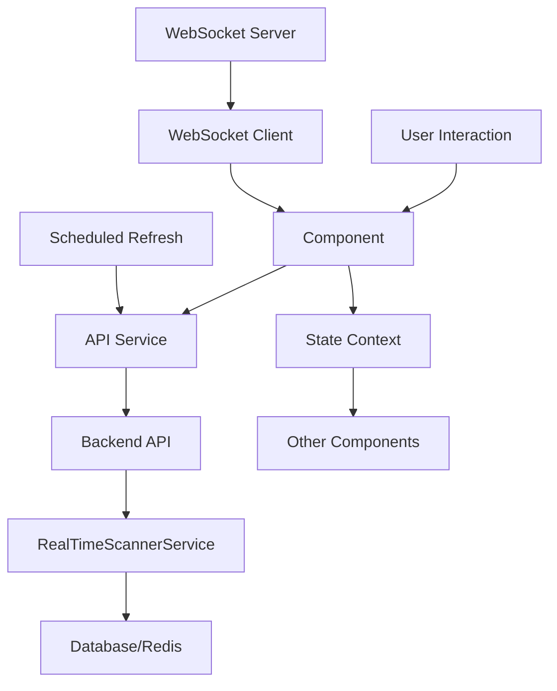

# Real-Time Scanner Component Specifications

## Overview
This document provides detailed specifications for the 10 core components of the redesigned real-time scanner UI. Each specification includes props, state, behavior, and integration points with the backend API.

## 1. ScannerDashboard Component

### Purpose
Main dashboard displaying real-time scanning overview, active sessions, and quick actions.

### Props Interface
```typescript
interface ScannerDashboardProps {
  userId: string;
  onSessionSelect?: (sessionId: string) => void;
  onQuickScan?: () => void;
  refreshInterval?: number; // milliseconds
}
```

### State Management
- **Local State**: 
  - `activeSessions: ScanSession[]`
  - `dashboardStats: DashboardStats`
  - `recentOpportunities: ScoredOpportunity[]`
  - `loading: boolean`
  - `error: string | null`

- **API Integration**:
  - `GET /api/real-time-scanner/dashboard` - Fetch dashboard data
  - `GET /api/real-time-scanner/sessions` - Fetch active sessions
  - WebSocket connection for real-time updates

### Component Structure
```
ScannerDashboard
├── DashboardHeader
│   ├── QuickScanButton
│   ├── CreateSessionButton
│   └── RefreshButton
├── StatsGrid
│   ├── ActiveSessionsCard
│   ├── OpportunitiesFoundCard
│   ├── AvgScanTimeCard
│   └── SuccessRateCard
├── ActiveSessionsList
│   ├── SessionProgressCard[]
│   └── ViewAllSessionsLink
└── RecentOpportunitiesTable
    ├── OpportunityRow[]
    └── ViewAllResultsLink
```

### Behavior
- Auto-refresh every 30 seconds (configurable)
- Real-time progress updates via WebSocket
- Click on session to navigate to SessionMonitor
- Click on opportunity to navigate to ResultsView

## 2. SessionCreationWizard Component

### Purpose
Multi-step wizard for creating new scan sessions with configuration options.

### Props Interface
```typescript
interface SessionCreationWizardProps {
  userId: string;
  onSuccess?: (sessionId: string) => void;
  onCancel?: () => void;
  initialPresetId?: string;
}
```

### State Management
- **Local State**:
  - `currentStep: number` (0-3)
  - `sessionConfig: SessionConfig`
  - `availablePresets: ScanPreset[]`
  - `availableSignals: SignalDefinition[]`
  - `validationErrors: string[]`

- **API Integration**:
  - `GET /api/real-time-scanner/presets` - Fetch scan presets
  - `GET /api/real-time-scanner/signals` - Fetch signal definitions
  - `POST /api/real-time-scanner/scan/start` - Start new session

### Wizard Steps
1. **Scope Selection**
   - Preset selection
   - Watchlist selection
   - Custom symbol input
   - Symbol count validation

2. **Signal Configuration**
   - Signal toggles (RSI, EMA, MACD, Volume, Price Change)
   - Parameter customization
   - Threshold adjustments
   - Signal weight configuration

3. **Ranking & Filtering**
   - Ranking weight configuration
   - Minimum confidence threshold
   - Maximum results limit
   - Filter by market cap/sector

4. **Review & Launch**
   - Configuration summary
   - Estimated time to completion
   - Session naming
   - Launch button

### Behavior
- Form validation at each step
- Real-time symbol count estimation
- Configuration persistence between steps
- Cancel confirmation dialog

## 3. SessionMonitor Component

### Purpose
Real-time monitoring of scan session progress with detailed visualization.

### Props Interface
```typescript
interface SessionMonitorProps {
  sessionId: string;
  userId: string;
  onSessionComplete?: (results: ScoredOpportunity[]) => void;
  onSessionCancel?: () => void;
}
```

### State Management
- **Local State**:
  - `session: ScanSession`
  - `progress: ScanProgressResponse`
  - `chunkStatus: ChunkStatus[]`
  - `realTimeUpdates: boolean`
  - `autoRefresh: boolean`

- **API Integration**:
  - `GET /api/real-time-scanner/scan/{sessionId}/progress` - Fetch progress
  - `GET /api/real-time-scanner/scan/{sessionId}` - Fetch session details
  - `POST /api/real-time-scanner/scan/{sessionId}/cancel` - Cancel session
  - WebSocket for real-time progress updates

### Component Structure
```
SessionMonitor
├── SessionHeader
│   ├── SessionTitle
│   ├── SessionStatusBadge
│   └── CancelButton
├── ProgressVisualization
│   ├── ProgressBar (overall)
│   ├── ChunkProgressGrid
│   └── TimeRemainingEstimate
├── RealTimeMetrics
│   ├── SymbolsProcessed
│   ├── OpportunitiesFound
│   ├── ProcessingRate
│   └── MemoryUsage
└── LiveLogFeed
    ├── LogEntry[]
    └── AutoScrollToggle
```

### Behavior
- Real-time progress updates (polling or WebSocket)
- Auto-refresh every 5 seconds when active
- Visual chunk status (pending, processing, completed, failed)
- Expandable log entries with filtering
- Cancel session with confirmation

## 4. ResultsView Component

### Purpose
Display and interact with scan results including filtering, sorting, and detailed analysis.

### Props Interface
```typescript
interface ResultsViewProps {
  sessionId: string;
  userId: string;
  initialFilters?: ResultFilters;
  onOpportunitySelect?: (opportunity: ScoredOpportunity) => void;
}
```

### State Management
- **Local State**:
  - `opportunities: ScoredOpportunity[]`
  - `filteredOpportunities: ScoredOpportunity[]`
  - `filters: ResultFilters`
  - `sortConfig: SortConfig`
  - `selectedOpportunity: ScoredOpportunity | null`
  - `loading: boolean`

- **API Integration**:
  - `GET /api/real-time-scanner/scan/{sessionId}/results` - Fetch results
  - `GET /api/real-time-scanner/scan/{sessionId}` - Fetch session metadata

### Component Structure
```
ResultsView
├── ResultsHeader
│   ├── ResultsCount
│   ├── ExportButton
│   └── RefreshButton
├── FilterPanel
│   ├── ConfidenceSlider
│   ├── SignalTypeCheckboxes
│   ├── SectorDropdown
│   └── MarketCapRange
├── ResultsTable
│   ├── SortableHeader[]
│   ├── OpportunityRow[]
│   └── PaginationControls
└── OpportunityDetailPanel
    ├── SignalVisualization
    ├── ScoreBreakdown
    ├── HistoricalChart
    └── ActionButtons
```

### Behavior
- Real-time filtering as filters change
- Multi-column sorting
- Pagination with configurable page size
- Export to CSV/JSON functionality
- Click row to expand detail panel
- Responsive layout for mobile

## 5. SignalVisualization Component

### Purpose
Visual representation of detected signals with confidence indicators.

### Props Interface
```typescript
interface SignalVisualizationProps {
  signals: Signal[];
  opportunity: EnhancedMarketData;
  showConfidence?: boolean;
  interactive?: boolean;
  onSignalClick?: (signal: Signal) => void;
}
```

### State Management
- **Local State**:
  - `expandedSignal: Signal | null`
  - `visualizationType: 'compact' | 'detailed'`

### Component Structure
```
SignalVisualization
├── SignalGrid
│   ├── SignalCard[]
│   └── ExpandAllButton
├── ConfidenceIndicator
│   ├── ConfidenceBar
│   └── ConfidenceScore
└── SignalDetailModal
    ├── SignalParameters
    ├── HistoricalContext
    └── ActionButtons
```

### Signal Types Visualization
- **RSI**: Gauge meter with overbought/oversold zones
- **EMA**: Line chart with crossover indicators
- **MACD**: Histogram with signal line
- **Volume**: Bar chart with average comparison
- **Price Change**: Percentage change with trend arrow

### Behavior
- Hover over signal for tooltip with details
- Click signal to expand detailed view
- Toggle between compact and detailed views
- Animate confidence indicators

## 6. ProgressTracking Component

### Purpose
Reusable progress visualization for scan sessions and batch operations.

### Props Interface
```typescript
interface ProgressTrackingProps {
  progress: ScanProgressResponse;
  showChunkDetails?: boolean;
  showTimeEstimate?: boolean;
  showMetrics?: boolean;
  size?: 'small' | 'medium' | 'large';
  variant?: 'linear' | 'circular' | 'stepper';
}
```

### State Management
- **Local State**:
  - `lastUpdateTime: number`
  - `estimatedCompletion: Date | null`

### Component Variants
1. **Linear Progress Bar**: For overall progress
2. **Circular Progress**: For compact display
3. **Stepper Progress**: For multi-step processes
4. **Chunk Grid**: For batch processing visualization

### Behavior
- Smooth animation for progress updates
- Real-time time remaining estimation
- Color coding based on status (pending, processing, completed, failed)
- Responsive sizing

## 7. RankingConfiguration Component

### Purpose
Interactive configuration interface for ranking engine weights.

### Props Interface
```typescript
interface RankingConfigurationProps {
  initialWeights: RankingConfig;
  onChange: (weights: RankingConfig) => void;
  showPresets?: boolean;
}
```

### State Management
- **Local State**:
  - `weights: RankingConfig`
  - `presets: RankingPreset[]`
  - `totalWeight: number`

### Component Structure
```
RankingConfiguration
├── WeightSliders
│   ├── SignalWeightSlider
│   ├── VolumeWeightSlider
│   ├── ChangeWeightSlider
│   └── RecencyWeightSlider
├── PresetSelector
│   ├── PresetButton[]
│   └── SavePresetButton
└── WeightSummary
    ├── TotalWeightIndicator
    └── WeightDistributionChart
```

### Behavior
- Real-time weight normalization (total = 100%)
- Preset selection with preview
- Custom preset saving
- Visual feedback on weight distribution
- Reset to defaults option

## 8. BatchScanVisualization Component

### Purpose
Visual representation of batch scanning process with chunk status.

### Props Interface
```typescript
interface BatchScanVisualizationProps {
  chunks: ChunkStatus[];
  totalSymbols: number;
  processingRate: number;
  onChunkClick?: (chunkIndex: number) => void;
}
```

### State Management
- **Local State**:
  - `selectedChunk: number | null`
  - `viewMode: 'grid' | 'list' | 'timeline'`

### Visualization Modes
1. **Grid View**: Matrix of chunks with status colors
2. **List View**: Detailed list with progress per chunk
3. **Timeline View**: Gantt-style timeline of chunk processing

### Behavior
- Color coding: pending (gray), processing (blue), completed (green), failed (red)
- Hover over chunk for details
- Click chunk to view detailed logs
- Animated processing indicators
- Responsive layout adjusts based on chunk count

## 9. ScannerPresetManager Component

### Purpose
Manage and organize scan presets for quick reuse.

### Props Interface
```typescript
interface ScannerPresetManagerProps {
  userId: string;
  onPresetSelect?: (preset: ScanPreset) => void;
  onPresetSave?: (preset: ScanPreset) => void;
}
```

### State Management
- **Local State**:
  - `presets: ScanPreset[]`
  - `editingPreset: ScanPreset | null`
  - `searchQuery: string`
  - `filterCategory: string`

- **API Integration**:
  - `GET /api/real-time-scanner/presets` - Fetch presets
  - Custom endpoints for preset CRUD operations

### Component Structure
```
ScannerPresetManager
├── PresetGrid
│   ├── PresetCard[]
│   └── CreatePresetCard
├── PresetEditor
│   ├── PresetForm
│   └── Save/CancelButtons
└── PresetActions
    ├── DuplicateButton
    ├── DeleteButton
    └── ExportButton
```

### Behavior
- Search and filter presets
- Drag-and-drop preset organization
- Preset duplication with modification
- Import/export preset configurations
- Category management

## 10. RealTimeMetricsPanel Component

### Purpose
Display real-time system metrics and performance indicators.

### Props Interface
```typescript
interface RealTimeMetricsPanelProps {
  sessionId?: string;
  refreshInterval?: number;
  compact?: boolean;
}
```

### State Management
- **Local State**:
  - `metrics: SystemMetrics`
  - `historicalMetrics: MetricsHistory[]`
  - `timeRange: '1h' | '6h' | '24h'`

- **API Integration**:
  - Custom metrics endpoint
  - WebSocket for real-time metrics

### Metrics Displayed
- **Processing Rate**: Symbols per second
- **Memory Usage**: Current vs. maximum
- **CPU Utilization**: Percentage
- **Cache Hit Rate**: Percentage
- **Error Rate**: Failed requests percentage
- **Queue Length**: Pending operations

### Behavior
- Real-time updates via WebSocket
- Historical trend charts
- Threshold warnings (color changes)
- Expandable detailed view
- Export metrics data

## Component Integration Architecture

### State Management Strategy
```typescript
// Global scanner state using React Context
interface ScannerContextType {
  activeSessions: ScanSession[];
  dashboardStats: DashboardStats;
  userPreferences: ScannerPreferences;
  addSession: (session: ScanSession) => void;
  updateSessionProgress: (sessionId: string, progress: ScanProgressResponse) => void;
  removeSession: (sessionId: string) => void;
}

// API Service Layer
class RealTimeScannerService {
  async startScanSession(config: SessionConfig): Promise<ScanSession>;
  async getSessionProgress(sessionId: string): Promise<ScanProgressResponse>;
  async getSessionResults(sessionId: string): Promise<ScoredOpportunity[]>;
  async getDashboardData(userId: string): Promise<DashboardData>;
  async getSignalDefinitions(): Promise<SignalDefinition[]>;
  async getScanPresets(): Promise<ScanPreset[]>;
  async cancelScanSession(sessionId: string): Promise<void>;
}

// WebSocket Integration
interface ScannerWebSocketClient {
  connect(): void;
  disconnect(): void;
  subscribeToSession(sessionId: string): void;
  unsubscribeFromSession(sessionId: string): void;
  onProgressUpdate(callback: (update: ProgressUpdate) => void): void;
  onSessionComplete(callback: (sessionId: string) => void): void;
}
```

### Data Flow Diagram


### Responsive Design Breakpoints
- **Mobile (< 768px)**: Single column, collapsed panels, touch-friendly controls
- **Tablet (768px - 1024px)**: Two-column layout, moderate information density
- **Desktop (> 1024px)**: Multi-column layout, full feature set, side-by-side panels

### Accessibility Requirements
- WCAG AA compliance
- Keyboard navigation support
- Screen reader compatibility
- High contrast mode support
- Reduced motion preferences

## Implementation Priority

### Phase 1 (Foundation)
1. ScannerDashboard
2. ProgressTracking
3. Basic SessionMonitor

### Phase 2 (Core Features)
4. SessionCreationWizard
5. ResultsView
6. SignalVisualization

### Phase 3 (Enhanced Features)
7. RankingConfiguration
8. BatchScanVisualization
9. ScannerPresetManager

### Phase 4 (Advanced Features)
10. RealTimeMetricsPanel
11. WebSocket integration
12. Advanced filtering

## Next Steps
1. Create TypeScript interfaces for all component props
2. Develop mock data generators for testing
3. Create component storybook for visual testing
4. Implement API service layer
5. Build foundation components
6. Integrate with existing scanner service

---
*These component specifications provide a detailed blueprint for implementing the redesigned real-time scanner UI, ensuring consistency, maintainability, and optimal user experience.*