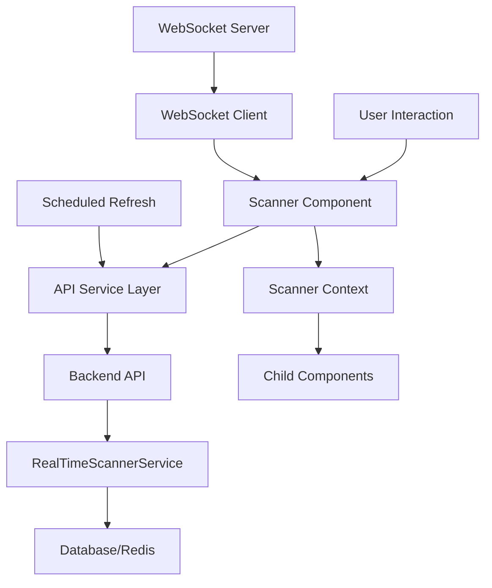

# Scanner UX Revamp - Implementation Plan

## Executive Summary
This document outlines the phased implementation plan for replacing the existing scanner UX with a modern, intuitive, and high-performance interface as specified in the design documents at `plans/ux-design/scanner/`.

## Current State Analysis

### Existing Implementation
- **Frontend**: Rule-based scanner at [`frontend/src/components/Scanner/index.tsx`](frontend/src/components/Scanner/index.tsx)
- **Backend**: 
  - Traditional scanner service at [`backend/src/api/scanners/router.ts`](backend/src/api/scanners/router.ts)
  - Real-time scanner service at [`backend/src/api/real-time-scanner/router.ts`](backend/src/api/real-time-scanner/router.ts)
  - Scanner engine at [`backend/src/scanners/`](backend/src/scanners/)

### Design Specifications
- 10 core components defined in `real-time-scanner-component-specs.md`
- UX redesign documented in `real-time-scanner-ui-redesign.md`
- Component specifications include props, state, behavior, and API integration

## Implementation Strategy

### Phased Rollout Approach
We will implement the revamp in 4 phases to ensure stability and allow for incremental testing:

**Phase 1: Foundation & Core Components** (Weeks 1-2)
- TypeScript interfaces and data models
- Foundation components (ProgressTracking, SignalVisualization)
- ScannerDashboard component
- Basic API service layer

**Phase 2: Session Management** (Weeks 3-4)
- SessionCreationWizard component
- SessionMonitor component  
- ResultsView component
- Enhanced API integration

**Phase 3: Advanced Features** (Weeks 5-6)
- RankingConfiguration component
- BatchScanVisualization component
- ScannerPresetManager component
- WebSocket integration for real-time updates

**Phase 4: Polish & Integration** (Weeks 7-8)
- RealTimeMetricsPanel component
- Responsive design and accessibility
- End-to-end testing and bug fixes
- Documentation and deployment

## Technical Architecture

### Frontend Architecture
```
New Scanner UX Structure:
frontend/src/components/ScannerV2/
├── index.tsx                    # Main scanner component (replaces existing)
├── types/                       # TypeScript interfaces
├── services/                    # API service layer
├── context/                     # React context for state management
├── components/                  # Individual component implementations
│   ├── ScannerDashboard/
│   ├── SessionCreationWizard/
│   ├── SessionMonitor/
│   ├── ResultsView/
│   ├── SignalVisualization/
│   ├── ProgressTracking/
│   ├── RankingConfiguration/
│   ├── BatchScanVisualization/
│   ├── ScannerPresetManager/
│   └── RealTimeMetricsPanel/
└── hooks/                       # Custom React hooks
```

### Backend Integration Points
The new frontend will integrate with existing backend endpoints:
- `GET /api/real-time-scanner/dashboard` - Dashboard data
- `POST /api/real-time-scanner/scan/start` - Start scan session
- `GET /api/real-time-scanner/scan/{sessionId}/progress` - Progress tracking
- `GET /api/real-time-scanner/scan/{sessionId}/results` - Results retrieval
- `GET /api/real-time-scanner/signals` - Signal definitions
- `GET /api/real-time-scanner/presets` - Scan presets

### Data Flow


## Component Implementation Details

### 1. ScannerDashboard Component
**Priority**: High (Phase 1)
**Location**: `frontend/src/components/ScannerV2/components/ScannerDashboard/`
**Key Features**:
- Real-time scanning overview
- Active sessions list
- Quick actions panel
- Dashboard statistics cards
- Auto-refresh every 30 seconds

### 2. SessionCreationWizard Component  
**Priority**: High (Phase 2)
**Location**: `frontend/src/components/ScannerV2/components/SessionCreationWizard/`
**Key Features**:
- Multi-step wizard (Scope → Signals → Ranking → Review)
- Form validation at each step
- Real-time symbol count estimation
- Configuration persistence

### 3. SessionMonitor Component
**Priority**: High (Phase 2)
**Location**: `frontend/src/components/ScannerV2/components/SessionMonitor/`
**Key Features**:
- Real-time progress visualization
- Chunk status grid
- Live log feed
- Cancel session functionality
- Auto-refresh every 5 seconds

### 4. ResultsView Component
**Priority**: Medium (Phase 2)
**Location**: `frontend/src/components/ScannerV2/components/ResultsView/`
**Key Features**:
- Filterable/sortable results table
- Opportunity detail panel
- Export functionality (CSV/JSON)
- Pagination with configurable page size

### 5. SignalVisualization Component
**Priority**: Medium (Phase 1)
**Location**: `frontend/src/components/ScannerV2/components/SignalVisualization/`
**Key Features**:
- Visual representation of detected signals
- Confidence indicators
- Interactive signal cards
- Detailed modal view on click

### 6. ProgressTracking Component
**Priority**: High (Phase 1)
**Location**: `frontend/src/components/ScannerV2/components/ProgressTracking/`
**Key Features**:
- Reusable progress visualization
- Multiple variants (linear, circular, stepper)
- Chunk grid visualization
- Time remaining estimation

### 7. RankingConfiguration Component
**Priority**: Medium (Phase 3)
**Location**: `frontend/src/components/ScannerV2/components/RankingConfiguration/`
**Key Features**:
- Interactive weight sliders
- Preset selection
- Weight normalization (total = 100%)
- Visual weight distribution chart

### 8. BatchScanVisualization Component
**Priority**: Medium (Phase 3)
**Location**: `frontend/src/components/ScannerV2/components/BatchScanVisualization/`
**Key Features**:
- Visual chunk status display
- Multiple view modes (grid, list, timeline)
- Color-coded status indicators
- Clickable chunks for details

### 9. ScannerPresetManager Component
**Priority**: Low (Phase 3)
**Location**: `frontend/src/components/ScannerV2/components/ScannerPresetManager/`
**Key Features**:
- Preset CRUD operations
- Search and filter functionality
- Preset duplication
- Import/export capabilities

### 10. RealTimeMetricsPanel Component
**Priority**: Low (Phase 4)
**Location**: `frontend/src/components/ScannerV2/components/RealTimeMetricsPanel/`
**Key Features**:
- System performance metrics
- Historical trend charts
- Threshold warnings
- Expandable detailed view

## API Service Layer

### New Service Implementation
```typescript
// frontend/src/components/ScannerV2/services/RealTimeScannerService.ts
class RealTimeScannerService {
  async startScanSession(config: SessionConfig): Promise<ScanSession>;
  async getSessionProgress(sessionId: string): Promise<ScanProgressResponse>;
  async getSessionResults(sessionId: string): Promise<ScoredOpportunity[]>;
  async getDashboardData(userId: string): Promise<DashboardData>;
  async getSignalDefinitions(): Promise<SignalDefinition[]>;
  async getScanPresets(): Promise<ScanPreset[]>;
  async cancelScanSession(sessionId: string): Promise<void>;
}
```

### WebSocket Integration
- Real-time progress updates via WebSocket
- Fallback to polling if WebSocket unavailable
- Automatic reconnection with exponential backoff
- Session-specific subscriptions

## Backend Fortification Strategy

During end-to-end testing, we will:
1. **Identify and fix API bugs** - Ensure robust error handling and validation
2. **Optimize performance bottlenecks** - Profile database queries, caching strategies
3. **Address security vulnerabilities** - Input validation, authentication/authorization
4. **Resolve data inconsistencies** - Data integrity checks, transaction management
5. **Improve API documentation** - OpenAPI/Swagger documentation, type definitions

## Testing Approach

### Minimal Testing Strategy
- **Manual verification** of all user flows
- **Integration testing** with actual backend APIs
- **Cross-browser compatibility** testing (Chrome, Firefox, Safari)
- **Responsive design** testing across device sizes
- **Accessibility** testing (WCAG AA compliance)

### Key Test Scenarios
1. Complete scan session flow (create → monitor → view results)
2. Real-time progress updates (WebSocket/polling)
3. Error handling and recovery
4. Responsive behavior across breakpoints
5. Keyboard navigation and screen reader compatibility

## Accessibility Requirements

### WCAG AA Compliance
- Keyboard navigation support for all interactive elements
- Screen reader compatibility with ARIA labels
- High contrast mode support
- Reduced motion preferences
- Focus management and visible focus indicators

### Responsive Design Breakpoints
- **Mobile (< 768px)**: Single column, collapsed panels
- **Tablet (768px - 1024px)**: Two-column layout
- **Desktop (> 1024px)**: Multi-column layout, full feature set

## Migration Strategy

### Phase 1: Parallel Implementation
- Create new components in `ScannerV2/` directory
- Maintain existing scanner at current route
- Test new components independently

### Phase 2: Feature Flag Rollout
- Add feature flag to enable new scanner
- Gradual user rollout (10% → 50% → 100%)
- Collect feedback and fix issues

### Phase 3: Complete Replacement
- Update route from `/scanner` to use new implementation
- Remove old scanner component
- Update navigation and documentation

## Success Metrics

### Performance Metrics
- Page load time < 3 seconds
- Time to first scan result < 10 seconds
- Real-time update latency < 2 seconds
- API response time < 500ms (p95)

### User Experience Metrics
- Task completion rate > 90%
- User satisfaction score > 4/5
- Error rate < 1%
- Accessibility compliance score 100%

## Risks and Mitigations

### Technical Risks
1. **Backend API incompatibility** - Maintain backward compatibility during transition
2. **Performance degradation** - Implement lazy loading, code splitting
3. **Browser compatibility issues** - Polyfill support, progressive enhancement

### Mitigation Strategies
- Comprehensive integration testing
- Feature flag rollout with quick rollback capability
- Performance monitoring and alerting
- User feedback collection mechanism

## Deliverables

### Phase 1 Deliverables
1. TypeScript interfaces and data models
2. Foundation components (ProgressTracking, SignalVisualization)
3. ScannerDashboard component
4. Basic API service layer integration

### Phase 2 Deliverables
1. SessionCreationWizard component
2. SessionMonitor component
3. ResultsView component
4. Enhanced API integration

### Phase 3 Deliverables
1. RankingConfiguration component
2. BatchScanVisualization component
3. ScannerPresetManager component
4. WebSocket integration

### Phase 4 Deliverables
1. RealTimeMetricsPanel component
2. Responsive design and accessibility implementation
3. End-to-end testing completion
4. Documentation and deployment

## Timeline Estimate

### Phase 1: Foundation (2 weeks)
- Week 1: TypeScript interfaces, foundation components
- Week 2: ScannerDashboard, basic API integration

### Phase 2: Core Features (2 weeks)
- Week 3: SessionCreationWizard, SessionMonitor
- Week 4: ResultsView, enhanced API integration

### Phase 3: Advanced Features (2 weeks)
- Week 5: RankingConfiguration, BatchScanVisualization
- Week 6: ScannerPresetManager, WebSocket integration

### Phase 4: Polish & Deployment (2 weeks)
- Week 7: RealTimeMetricsPanel, responsive design
- Week 8: Testing, documentation, deployment

**Total Estimated Duration**: 8 weeks

## Next Steps

1. **Review and approve** this implementation plan
2. **Begin Phase 1 implementation** with TypeScript interfaces
3. **Weekly progress reviews** to track implementation
4. **User feedback collection** during phased rollout

---

*This plan provides a comprehensive roadmap for delivering a modern, intuitive, and high-performance scanner UX that fully replaces the existing implementation while maintaining backward compatibility and ensuring a smooth user transition.*