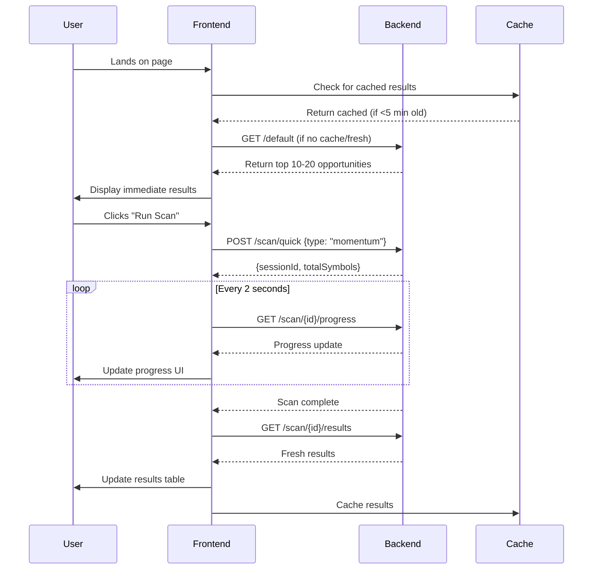

# Simplified Real-Time Scanner UX Design
## Frontend Architecture & API Integration Plan

**Date**: 2026-04-20  
**Status**: Design Phase  
**Target**: Senior Product Architect + Frontend Architect

---

## 🎯 Executive Summary

This document outlines a complete redesign of the Real-Time Scanner frontend UX to transform it from a "configuration tool" into a "smart trading assistant." The design focuses on **zero-friction entry**, **results-first design**, and **simple mental models** while leveraging the existing backend capabilities.

### Core Principles
1. **Instant Value**: Show opportunities immediately on landing
2. **Minimal Configuration**: Hide advanced features (rule engine, presets, signals)
3. **Assistant Mindset**: Answer "What are the best trading opportunities right now?"
4. **Progressive Disclosure**: Advanced features available but not prominent

---

## 🏗️ 1. Frontend Component Architecture

### Component Hierarchy (Simplified UX)

```
SimplifiedScannerDashboard (New Root Component)
├── ScannerHeader
│   ├── LastUpdatedTimestamp
│   ├── RunScanButton (Primary CTA)
│   └── ScanTypeDropdown (Momentum/Reversal/Trend)
├── ResultsSection
│   ├── ResultsStats (Showing X opportunities, updated X ago)
│   ├── ResultsTable
│   │   ├── ResultRow (Top 10-20)
│   │   │   ├── SymbolWithPrice
│   │   │   ├── ScoreBadge (Visual score indicator)
│   │   │   ├── SignalBadges (RSI Oversold, EMA Crossover, etc.)
│   │   │   ├── QuickActions (Add to Watchlist, Expand)
│   │   │   └── ExpandableDetailPanel
│   │   └── TableControls (Sort, Filter basic)
│   └── LoadMoreButton / Auto-refresh toggle
├── ScanProgressOverlay (Modal/Inline)
│   ├── ProgressIndicator (Linear/Circular)
│   ├── ScanStats (Scanning X stocks... X found)
│   └── CancelScanButton
└── AdvancedControlsPanel (Collapsible)
    ├── PresetSelector (Maps to backend presets)
    ├── SignalFilter (Basic signal type toggles)
    └── "Show Advanced Settings" → Links to existing full scanner
```

### Dual-Mode Approach
- **Simple Mode**: New components (`frontend/src/components/Scanner/SimpleScanner/`)
- **Advanced Mode**: Existing components (unchanged, accessible via link)
- **Navigation**: Tabbed interface or mode toggle

---

## 📊 2. State Management Strategy

### Zustand Store Structure
```typescript
interface SimplifiedScannerStore {
  // Core State
  scanState: 'idle' | 'scanning' | 'completed' | 'error';
  scanType: 'momentum' | 'reversal' | 'trend' | 'default';
  
  // Results
  opportunities: SimplifiedOpportunity[];
  lastUpdated: string | null;
  
  // Scan Progress
  scanProgress: {
    sessionId: string | null;
    totalSymbols: number;
    processedSymbols: number;
    opportunitiesFound: number;
    estimatedTimeRemaining: number;
  };
  
  // UI State
  expandedRowId: string | null;
  showAdvancedControls: boolean;
  
  // Actions
  startScan: (type: ScanType) => Promise<void>;
  cancelScan: () => Promise<void>;
  refreshResults: () => Promise<void>;
  toggleRowExpansion: (id: string) => void;
  addToWatchlist: (symbol: string) => Promise<void>;
}
```

### State Flow
1. **Initial Load**: Fetch cached/default results immediately
2. **Scan Start**: Update scanState → polling for progress → update results
3. **Real-time Updates**: WebSocket/SSE for progress updates
4. **Results Cache**: Local storage for offline viewing

---

## 🔌 3. API Integration Flow

### Required New Endpoints (Backend)
1. `GET /real-time-scanner/default` - Zero-config default scan results
2. `POST /real-time-scanner/scan/quick` - Quick scan with type parameter
3. `GET /real-time-scanner/scan/{id}/progress` - Existing, used for polling
4. `GET /real-time-scanner/scan/{id}/results` - Existing, used for results
5. `GET /real-time-scanner/presets/simple` - Simplified preset mapping

### Sequence Diagram


### Polling Strategy
- **Progress**: Poll every 2 seconds during scan
- **Results**: Poll every 30 seconds when idle (optional auto-refresh)
- **Backoff**: Exponential backoff on errors
- **WebSocket**: Future enhancement for real-time updates

---

## 📝 4. Key TypeScript Interfaces

### Simplified Data Models
```typescript
// Core simplified interfaces
export interface SimplifiedOpportunity {
  id: string;
  symbol: string;
  companyName?: string;
  price: number;
  change: number; // percentage
  changeAmount: number; // absolute
  volume: number;
  score: number; // 0-100
  confidence: number; // 0-100
  rank: number;
  signals: SimplifiedSignal[];
  sector?: string;
  marketCap?: number;
  lastUpdated: string;
}

export interface SimplifiedSignal {
  type: SignalType;
  name: string; // Human-readable: "RSI Oversold", "MACD Bullish Crossover"
  confidence: number;
  direction: 'bullish' | 'bearish' | 'neutral';
  description: string; // "RSI below 30 indicates oversold condition"
}

export type ScanType = 'momentum' | 'reversal' | 'trend' | 'default';

export interface ScanProgress {
  sessionId: string;
  status: 'pending' | 'processing' | 'completed' | 'failed';
  totalSymbols: number;
  processedSymbols: number;
  opportunitiesFound: number;
  progressPercentage: number;
  estimatedTimeRemaining: number; // seconds
  startedAt: string;
}

// API Request/Response
export interface QuickScanRequest {
  scanType: ScanType;
  symbolLimit?: number; // Optional: limit scan to top N symbols
}

export interface DefaultScanResponse {
  opportunities: SimplifiedOpportunity[];
  scanType: ScanType;
  generatedAt: string;
  cacheAge: number; // seconds since generation
}
```

### Mapping from Backend Models
```typescript
// Transformation function
const transformBackendToSimplified = (
  backendOpportunity: ScoredOpportunity
): SimplifiedOpportunity => ({
  id: backendOpportunity.id,
  symbol: backendOpportunity.symbol,
  price: backendOpportunity.metadata.price,
  change: backendOpportunity.metadata.change,
  changeAmount: calculateChangeAmount(backendOpportunity.metadata),
  volume: backendOpportunity.metadata.volume,
  score: backendOpportunity.score,
  confidence: backendOpportunity.confidence,
  rank: backendOpportunity.rank,
  signals: transformSignals(backendOpportunity.signals),
  sector: backendOpportunity.metadata.sector,
  marketCap: backendOpportunity.metadata.marketCap,
  lastUpdated: backendOpportunity.detectedAt,
});
```

---

## 🎨 5. UX Flow Walkthrough

### Step 1: User Lands on Page (Zero-Friction Entry)
1. **Immediate Display**: Show cached/default results within 500ms
2. **Visual Hierarchy**:
   - Large "Run Scan" button (primary CTA)
   - Scan type selector (Momentum/Reversal/Trend)
   - Results table with top opportunities
3. **No Configuration**: User sees value immediately

### Step 2: User Runs a Scan
1. **Single Click**: Click "Run Scan" → scan starts with last used/default type
2. **Progress Feedback**:
   - Non-blocking progress overlay
   - "Scanning 120 stocks..." with live counter
   - Continue viewing cached results during scan
3. **Completion**: Results automatically refresh

### Step 3: User Interacts with Results
1. **Expand Row**: Click → shows "Why this stock" with signal explanations
2. **Add to Watchlist**: One-click add with visual feedback
3. **Sort/Filter**: Basic controls (score, change, sector)
4. **View Details**: Link to full stock analysis page

### Step 4: Advanced Features (Progressive Disclosure)
1. **"Show Advanced"**: Collapsible panel with:
   - Preset selector (maps to backend presets)
   - Signal type filters
   - Link to full scanner configuration
2. **Mode Switch**: "Switch to Advanced Scanner" button

---

## 🔄 6. Data Transformation Layer

### Signal Translation Service
```typescript
class SignalTranslationService {
  // Convert raw signal data to human-readable format
  static translateSignal(signal: Signal): SimplifiedSignal {
    const translations: Record<SignalType, SignalTranslator> = {
      RSI: (value, threshold) => 
        value < 30 ? 'RSI Oversold' : 
        value > 70 ? 'RSI Overbought' : 'RSI Neutral',
      EMA: (value, params) => {
        const { period1, period2 } = params;
        return `EMA ${period1}/${period2} Crossover`;
      },
      MACD: (value, params) => 
        value > 0 ? 'MACD Bullish' : 'MACD Bearish',
      VOLUME: (value, avgVolume) =>
        value > avgVolume * 1.5 ? 'Volume Spike' : 'Normal Volume',
      // ... other signal types
    };
    
    const translator = translations[signal.type];
    return {
      type: signal.type,
      name: translator ? translator(signal.value, signal.parameters) : signal.type,
      confidence: signal.confidence,
      direction: signal.direction,
      description: this.getSignalDescription(signal.type, signal.parameters),
    };
  }
  
  // Generate human-readable explanations
  static getSignalDescription(type: SignalType, params: any): string {
    const descriptions = {
      RSI: `RSI value of ${params.value} indicates ${params.value < 30 ? 'oversold' : 'overbought'} conditions.`,
      EMA: `EMA crossover suggests trend change.`,
      MACD: `MACD histogram shows ${params.value > 0 ? 'bullish' : 'bearish'} momentum.`,
      VOLUME: `Volume ${params.ratio > 1 ? 'above' : 'below'} average.`,
    };
    return descriptions[type] || 'Technical signal detected.';
  }
}
```

### Score Visualization
- **Color Coding**: Red → Yellow → Green gradient based on score
- **Badge System**: 
  - 🔥 Hot Opportunity (score > 85)
  - ⚡ Strong Signal (score 70-85)
  - 📈 Worth Watching (score 50-70)

---

## ⚡ 7. Performance Considerations

### Optimization Strategies
1. **Virtual Scrolling**: For large results sets (>50 items)
2. **Lazy Loading**: Images, detailed signal data
3. **Request Debouncing**: Search/filter inputs
4. **Cache Strategy**:
   - LocalStorage for results (5-minute TTL)
   - Service Worker for offline capability
   - CDN for static assets

### Polling Efficiency
```typescript
// Smart polling implementation
class SmartPoller {
  private intervalId: NodeJS.Timeout | null = null;
  private pollCount = 0;
  private maxPollCount = 300; // 10 minutes at 2-second intervals
  
  startPolling(
    sessionId: string,
    onProgress: (progress: ScanProgress) => void,
    onComplete: (results: SimplifiedOpportunity[]) => void
  ) {
    this.intervalId = setInterval(async () => {
      if (this.pollCount++ > this.maxPollCount) {
        this.stopPolling();
        return;
      }
      
      const progress = await fetchProgress(sessionId);
      onProgress(progress);
      
      if (progress.status === 'completed') {
        this.stopPolling();
        const results = await fetchResults(sessionId);
        onComplete(results);
      }
    }, 2000);
  }
  
  stopPolling() {
    if (this.intervalId) {
      clearInterval(this.intervalId);
      this.intervalId = null;
    }
  }
}
```

### Bundle Size Optimization
- **Code Splitting**: Separate chunk for advanced features
- **Tree Shaking**: Remove unused scanner components from simple mode
- **Lazy Imports**: Signal visualization libraries loaded on demand

---

## 🚀 8. Progressive Enhancement

### Phase 1: MVP (Current)
- Basic polling-based scanning
- Cached results on load
- Simple signal translation

### Phase 2: Enhanced (Next 2-4 weeks)
- WebSocket/SSE for real-time updates
- Auto-refresh toggle
- Custom watchlist integration

### Phase 3: Advanced (Future)
- Machine learning recommendations
- Personalized scan types
- Mobile app with push notifications
- Multi-user collaboration features

---

## ⚖️ 9. Design Tradeoffs

### Tradeoff 1: Simplicity vs. Power
- **Decision**: Favor simplicity for primary flow
- **Compromise**: Advanced features accessible but not prominent
- **Rationale**: 80% of users need quick answers, not configuration

### Tradeoff 2: Real-time vs. Performance
- **Decision**: Polling initially, WebSocket later
- **Compromise**: 2-second polling interval
- **Rationale**: Faster implementation, acceptable latency

### Tradeoff 3: Cache Freshness vs. Speed
- **Decision**: Show cached results immediately
- **Compromise**: 5-minute cache TTL with freshness indicator
- **Rationale**: Better UX than waiting for fresh scan

### Tradeoff 4: Mobile Responsiveness
- **Decision**: Mobile-first responsive design
- **Compromise**: Simplified table on mobile (card view)
- **Rationale**: Trading happens on mobile devices

---

## 📋 10. Implementation Roadmap

### Week 1: Foundation
1. Create simplified TypeScript interfaces
2. Implement API service layer for new endpoints
3. Create basic store with Zustand
4. Build core `SimplifiedOpportunity` component

### Week 2: Core Components
1. Implement `SimplifiedScannerDashboard`
2. Build `ResultsTable` with virtual scrolling
3. Create `SignalBadge` and translation service
4. Implement scan progress overlay

### Week 3: Integration & Polish
1. Integrate with existing backend APIs
2. Implement caching layer
3. Add responsive design
4. Performance optimization

### Week 4: Testing & Launch
1. End-to-end testing
2. User acceptance testing
3. Performance benchmarking
4. Gradual rollout plan

---

## 🎯 Success Metrics

### Quantitative
- **Time to Value**: < 3 seconds from page load to seeing opportunities
- **Scan Completion Rate**: > 90% of started scans complete
- **User Engagement**: Daily active users increase by 30%
- **Conversion Rate**: Watchlist adds per session > 0.5

### Qualitative
- User feedback: "Feels like a smart assistant"
- Reduced support tickets for scanner configuration
- Increased user retention on scanner page

---

## 🔗 Integration Points

### With Existing System
1. **Backend**: Use existing scanner service with wrapper for simple endpoints
2. **Authentication**: Reuse existing auth system
3. **Watchlists**: Integrate with existing watchlist service
4. **Stock Details**: Link to existing stock analysis pages

### Future Extensions
1. **Alert System**: Integrate with existing alert engine
2. **Portfolio Integration**: Connect to user's portfolio
3. **Social Features**: Share scan results
4. **API Export**: Allow third-party integration

---

## 🛠️ Technical Dependencies

### Frontend
- React 18+ with TypeScript
- Zustand for state management
- Material-UI or custom design system
- Axios for API calls
- date-fns for date formatting

### Backend (New Endpoints)
- Express.js routes
- Redis for caching default results
- WebSocket server (future)

### Development
- Jest + React Testing Library
- Cypress for E2E testing
- Storybook for component documentation

---

## 🚨 Risk Mitigation

### Technical Risks
1. **Backend API Changes**: Create adapter layer to isolate frontend
2. **Performance Issues**: Implement comprehensive monitoring
3. **Browser Compatibility**: Test on target browsers early

### Product Risks
1. **User Resistance to Change**: Gradual rollout with option to revert
2. **Feature Regression**: Maintain existing advanced scanner unchanged
3. **Data Accuracy**: Clear labeling of cached vs. fresh results

---

## 📞 Contact & Ownership

- **Product Owner**: [To be assigned]
- **Frontend Lead**: [To be assigned]
- **Backend Lead**: [To be assigned]
- **UX Designer**: [To be assigned]

---

*This document serves as the comprehensive design specification for the Simplified Real-Time Scanner UX. All implementation should reference this document for architectural decisions and user experience guidelines.*